# Estudo de Caso: Análise de Vulnerabilidades e Ataques de Força Bruta no Metasploitable 2

  
  
  

* **Autor:** Evandro Mucha
* **Data de Execução:** 22 de outubro de 2025
* **LinkedIn:** [Evandro Mucha](https://br.linkedin.com/in/evandromucha)

---

## Índice

* [Aviso Ético e de Responsabilidade](#aviso-ético-e-de-responsabilidade) 
* [Sobre o Projeto](#1-sobre-o-projeto)
* [Ambiente e Tecnologias Utilizadas](#2-ambiente-e-tecnologias-utilizadas)
* [Execução](#3-execução)
  * [Comunicação Inicial](#31-comunicação-inicial)
  * [Ganhar acesso ao FTP (porta 21)](#32-ganhar-acesso-ao-ftp-porta-21)
  * [Ganhar acesso HTTP (DVWA - porta 80)](#33-ganhar-acesso-http-dvwa---porta-80)
  * [Ganhar acesso SMB (portas 139/445)](#34-ganhar-acesso-smb-portas-139445)
* [Recomendações de Mitigação](#4-recomendações-de-mitigação)
* [Conclusão](#5-conclusão)

---

## Aviso Ético e de Responsabilidade

Este estudo foi conduzido em um ambiente de laboratório virtual, isolado e controlado.
Todas as técnicas de enumeração de serviços e ataques de força bruta foram aplicadas para fins estritamente educacionais e como parte do desafio de projeto do Santander Cibersegurança 2025.
Nunca realize testes de invasão, varreduras de vulnerabilidade ou qualquer tipo de ataque em sistemas ou redes para os quais você não possua autorização explícita e por escrito. A utilização dessas ferramentas em ambientes de produção sem permissão é ilegal e antiética.

___

## 1. Sobre o Projeto

Este estudo documenta uma análise de vulnerabilidades e um pentest simulado, executados em um ambiente de laboratório estritamente controlado e isolado. O objetivo principal foi aplicar técnicas de reconhecimento e exploração de serviços para fins estritamente educacionais, como parte do desafio do Santander Cibersegurança 2025.

O laboratório foi configurado utilizando duas máquinas em uma rede interna e isolada:

* **Máquina Atacante:** Kali Linux, executado diretamente no Windows através do WSL 2 (Windows Subsystem for Linux). Esta abordagem permite o uso nativo das ferramentas do Kali sem a necessidade de uma máquina virtual separada para o atacante.

* **Máquina Alvo:** `192.168.7.232` Metasploitable 2, uma imagem de máquina virtual baseada em Ubuntu e intencionalmente vulnerável, projetada especificamente para treinamento de segurança. Esta VM foi executada no Oracle VirtualBox.

O foco do estudo foi identificar serviços vulneráveis (como FTP, HTTP, SMB) na máquina alvo e demonstrar como credenciais fracas e configurações inseguras podem ser exploradas usando ferramentas padrão da indústria.

---

## 2. Ambiente e Tecnologias Utilizadas

A execução deste projeto dependeu de um ambiente de laboratório controlado. Abaixo estão os principais componentes e ferramentas utilizados:

* **Oracle VirtualBox:** Software de virtualização (hypervisor) que permitiu a criação de um ambiente de rede isolado. Foi utilizado para hospedar e executar a máquina virtual alvo (Metasploitable 2) de forma segura, sem expô-la a redes externas.

* **Metasploitable 2:** A máquina virtual alvo. É um sistema operacional baseado em Linux (Ubuntu) intencionalmente projetado pela Rapid7 com uma vasta gama de vulnerabilidades de segurança. Serve como um "laboratório" legal e ético para praticar técnicas de pentest.

* **Kali Linux (via WSL 2):** A distribuição Linux utilizada como máquina atacante. É o padrão da indústria para testes de invasão, pois vem pré-carregada com um extenso arsenal de ferramentas de segurança. Foi executada via WSL (Windows Subsystem for Linux) para integração direta com o host Windows.

* **Nmap:** Ferramenta essencial para o reconhecimento e mapeamento de rede. Ele é utilizado para varredura de portas, identificando serviços ativos e as versões de software em execução no alvo. No pentest, o Nmap é o ponto de partida para descobrir a superfície de ataque da máquina alvo.

* **Medusa:** Uma ferramenta de linha de comando especializada em ataques de força bruta. Foi a principal ferramenta utilizada para automatizar a descoberta de credenciais, testando rapidamente milhares de combinações de usuário e senha contra serviços de rede como FTP e SMB.

* **enum4linux:** Utilitário focado em sistemas SMB (Samba). Ele permite a enumeração detalhada de usuários, grupos de trabalho e informações do sistema. É crucial para obter uma lista de usuários válidos, tornando os ataques de força bruta mais eficientes e direcionados.
  
---

## 3. Execução

O teste seguiu uma metodologia simplificada de pentest, focando nas fases de Reconhecimento e Ganho de Acesso. O endereço IP da máquina alvo é `192.168.7.232`.

## 3.1. Comunicação Inicial

O primeiro passo foi certificar que a máquina alvo é encontrada na rede.

  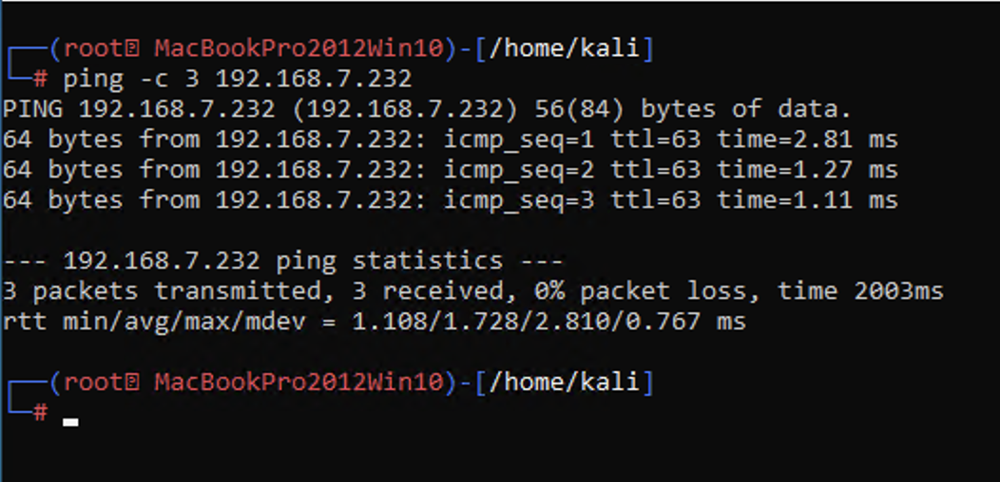

Feito isso, utilizo o `nmap` para verificar as portas:

  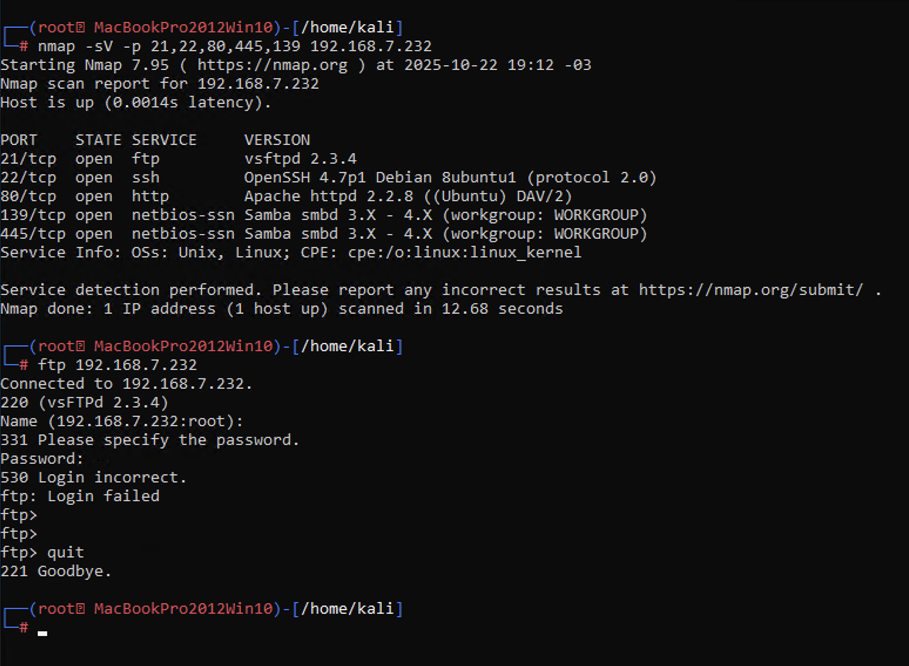

Testei a conexão `ftp` para verificar se o serviço estava ativo.

## 3.2. Ganhar acesso ao `FTP` (porta 21):

  
O próximo passo foi gerar as *world lists* com os nomes de [usuários](images/users.txt) e [senhas](pass.txt) :

  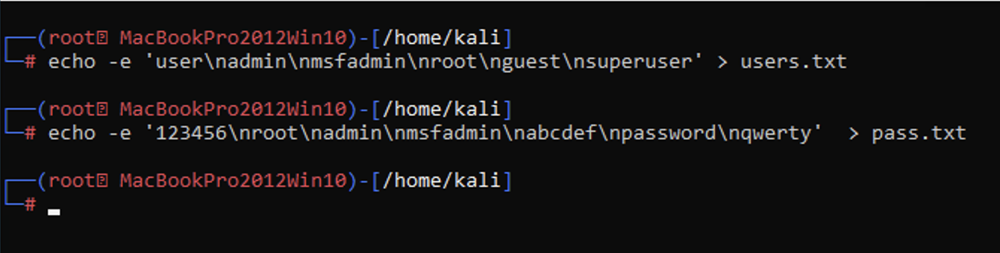

Então, executei o `medusa` para testar as credenciais para acesso ao `ftp`:

  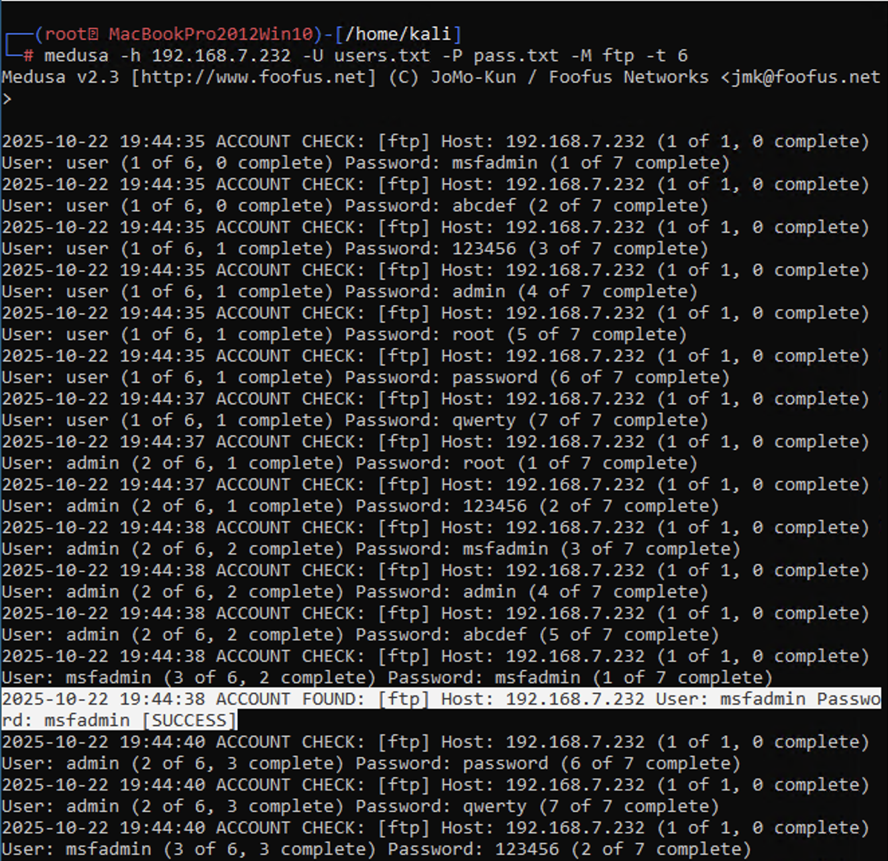

Com as credenciais encontradas, testei o acesso `ftp` com sucesso:

  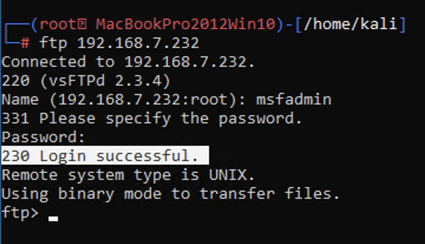

## 3.3. Ganhar acesso `HTTP` (DVWA - porta 80):

Verifiquei a página de *login* em `http://192.168.7.232/dvwa/login.php` e inspecionei a requisição de *login* no navegador.

  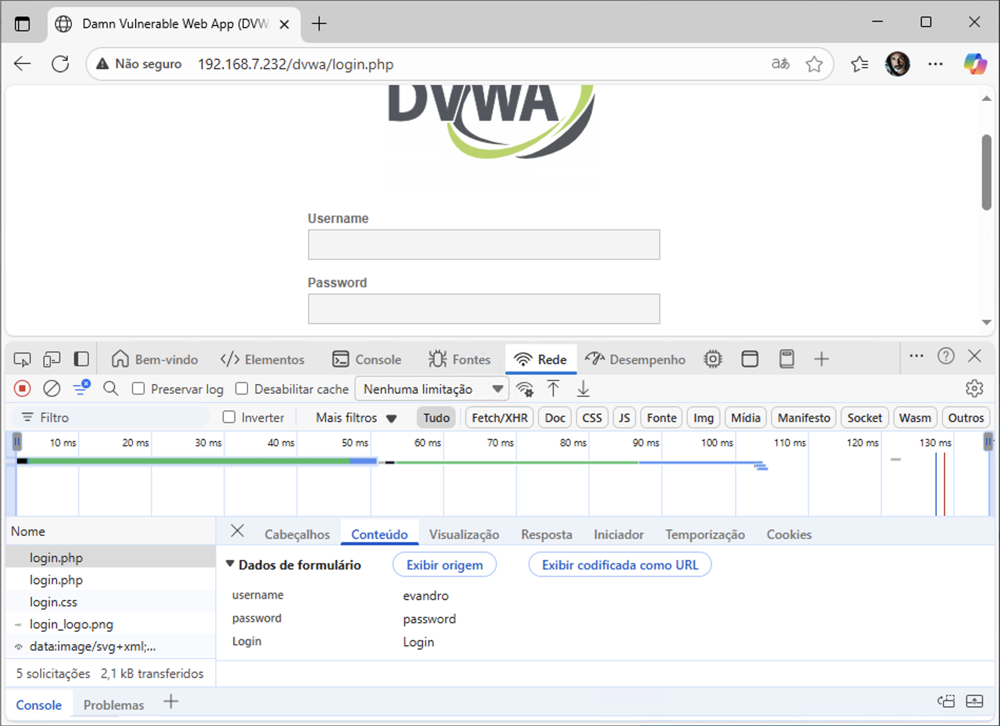

Utilizei o `medusa` com as *world lists* (utilizadas anteriormente) para verificar se alguma combinação de [usuário](images/users.txt) e [senha](images/pass.txt) eram válidos:

  

Como resultado, obtive o usuário *admin* e a senha *password*, testadas na página de *login*:

  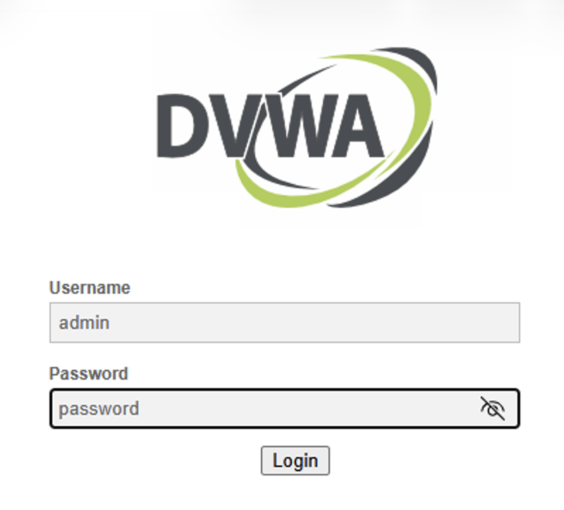

Confirmado o acesso com as credenciais encontradas:

  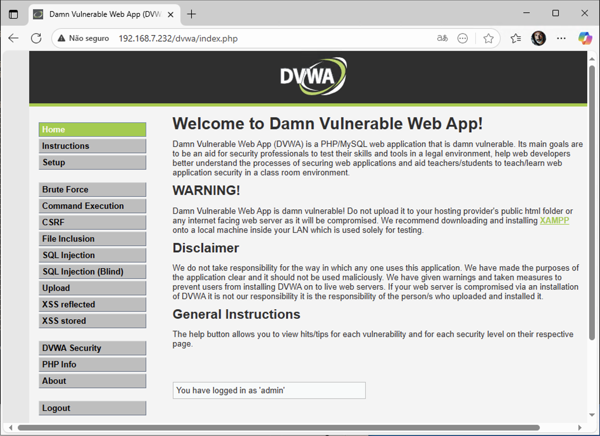

## 3.4. Ganhar acesso `SMB` (portas 139/445:

Aqui vamos testar a técnica de *password spraying* onde utilizamos um número pequeno de senhas contra muitas contas de usuário diferentes.

#### a. Enumeração de usuários

Utilizei o `enum4linux` para encontrar uma lista de nomes de usuários possíveis no alvo:

  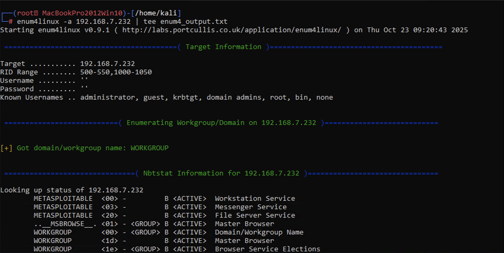

O resultado da busca foi guardado no arquivo [enum4_output.txt](images/enum4_output.txt) e a parte principal foi a lista de possíveis usuários do serviço alvo:

  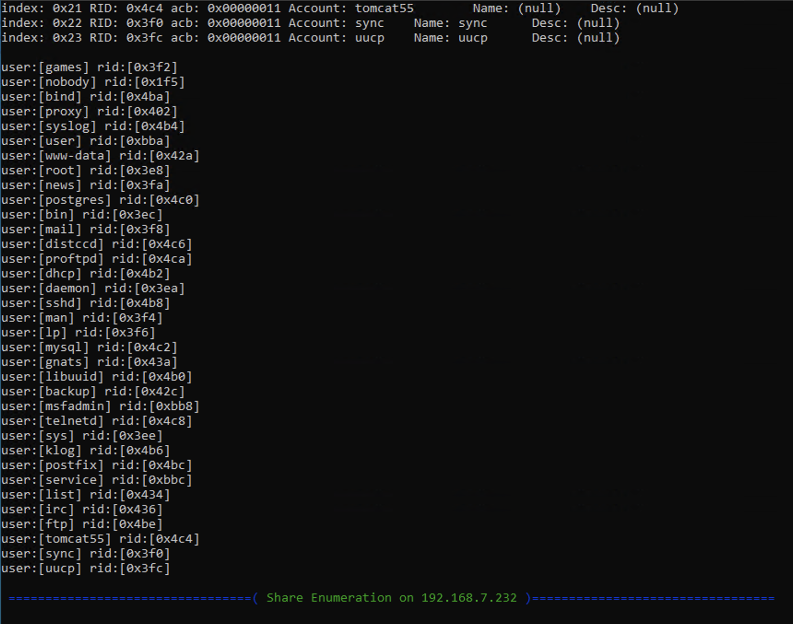

A partir disso, criei dois novos arquivos de *world lists* para esse teste: [usuários](images/smb_user.txt) e [senhas](images/senhas_spray.txt)

#### b. Ataque de Password Spraying

Utilizei o `medusa` para a busca de credenciais válidas:

  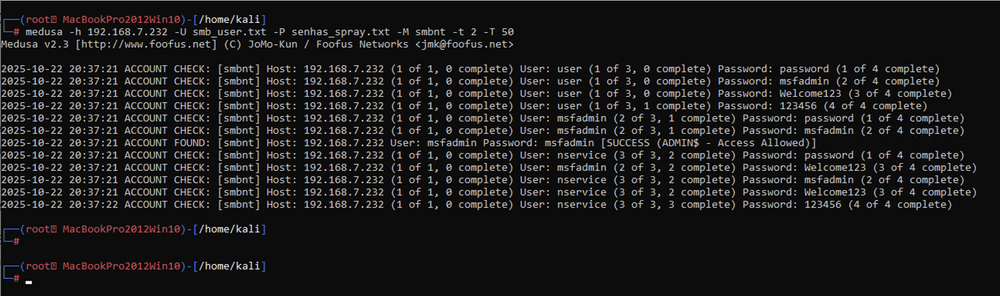

As credenciais encontradas foram `msfadmin`para usuário e `msfadmin` para senha, com esses dados, confimei o acesso ao serviço:

  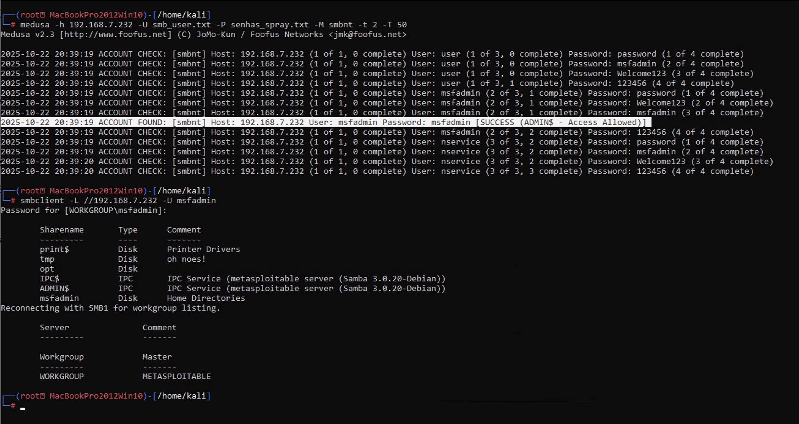

---

## 4. Recomendações de Mitigação

* **Políticas de Senhas Fortes:** Implementar uma política que exija senhas complexas e longas. O Metasploitable permitia senhas mínimas de 5 caracteres e não tinha complexidade obrigatória.
* **Bloqueio de Contas (Account Lockout):** Configurar o sistema para bloquear temporariamente uma conta após um número baixo de tentativas de login malsucedidas. O *Account Lockout Threshold* no Metasploitable estava desabilitado.
* **Substituir Serviços Obsoletos:** Substituir protocolos inseguros como FTP por SFTP (via SSH).
* **Segurança em Aplicações Web:** Adicionar mecanismos de defesa como CAPTCHAs, tokens anti-CSRF e limites de taxa de requisições para mitigar ataques em formulários web.

---

## 5. Conclusão

A execução deste projeto prático demonstrou de forma clara e metódica a criticidade de senhas fracas e de configurações de segurança padrão em múltiplos serviços de rede. O ambiente de laboratório (Kali Linux via WSL 2 e Metasploitable 2 no VirtualBox) permitiu simular um cenário de ameaça realista para fins de aprendizado.

**Principais Aprendizados e Demonstrações:**

1.  **Eficácia do Password Spraying:** O ataque ao serviço SMB utilizando a técnica de **Password Spraying** provou ser uma estratégia eficiente para explorar a falta de política de bloqueio de contas.
2.  **Versatilidade e Limitações do Medusa:** A ferramenta **Medusa** foi utilizada com sucesso em todos os alvos (FTP, HTTP e SMB). No entanto, o desafio de lidar com **falsos positivos** no formulário web (HTTP) destacou a importância de uma análise manual criteriosa dos resultados da ferramenta.
3.  **Vulnerabilidade Ubíqua:** O sucesso da exploração em todos os serviços (FTP, HTTP e SMB) confirma que a falha de segurança mais comum é a adoção de credenciais padrão ou excessivamente simples (ex: `msfadmin:msfadmin`, `admin:password`).

Este projeto consolida a importância de implementar políticas de senhas robustas, configurar bloqueios de contas e desativar serviços legados ou inseguros, sendo um passo essencial na formação de uma mentalidade focada em segurança.
